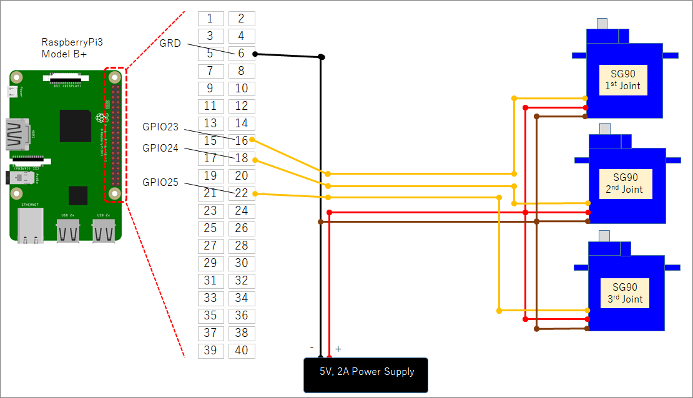
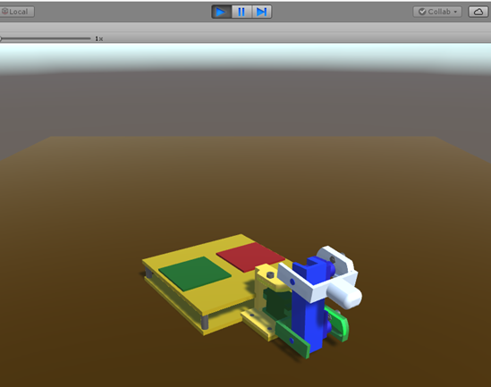

# Fingalone
A finger-type robot that moves with three servo motors.
The body parts were made by a 3D-printer.
The 3D data (stl) is available in stl_data directory.

To know what Fingalone is, see the English version video, 
https://youtu.be/FdAVnDT4Znc
or Japanese version video.
https://youtu.be/5YvKieTfd8s

## simple example

### Hargdware 
+ Raspberry pi 3, Model B+

### Wiring

### Software Environment
+ Python2.7
+ OpenCV3

### Execution Program
<pre>
>> sample_control.py
</pre>

### How to control
+ key [u][j] ... 1st joint
+ key [i][k] ... 2nd joint
+ key [o][l] ... 3rd joint

# Simulation by Unity

See the movie
https://youtu.be/FSkXYbJT66k

How to make it (Japanese)
http://itoshi.main.jp/tech/fingalone_unity/result/

A 3D data is "obj_data/Fingalone.obj".

A program for control is "unity/control_pattern.cs".

