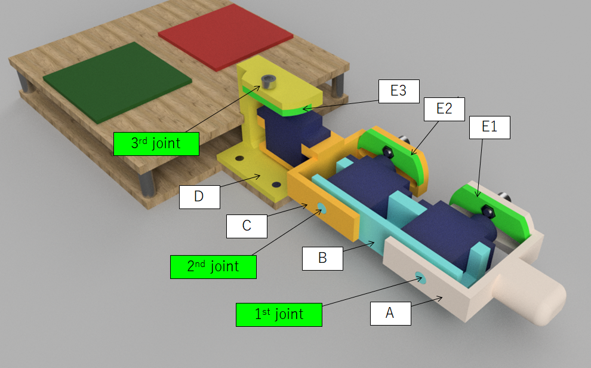

# Fingalone
A finger-type robot that moves with three servo motors.
The body parts were made by a 3D-printer.
The 3D data (stl) is available.

To know what Fingalone is, see the English version video, 
https://youtu.be/FdAVnDT4Znc
or Japanese version video.
https://youtu.be/5YvKieTfd8s

